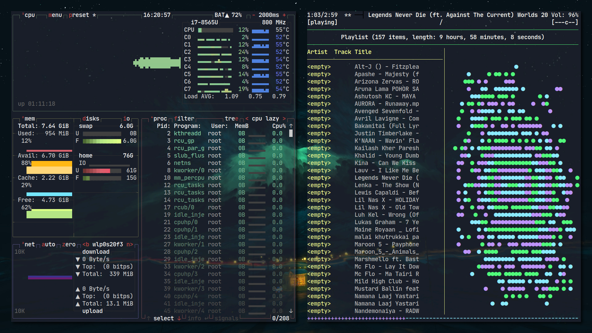
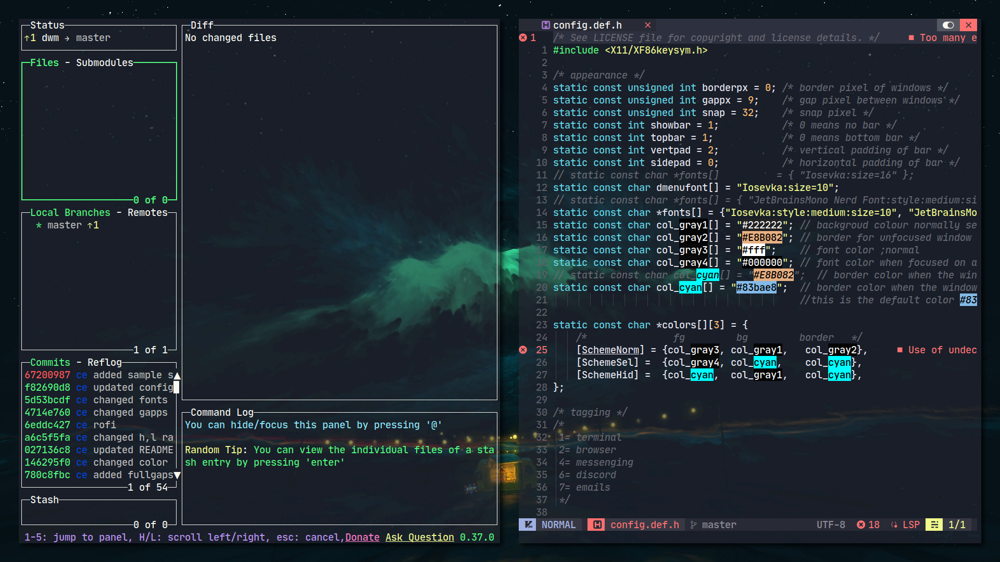
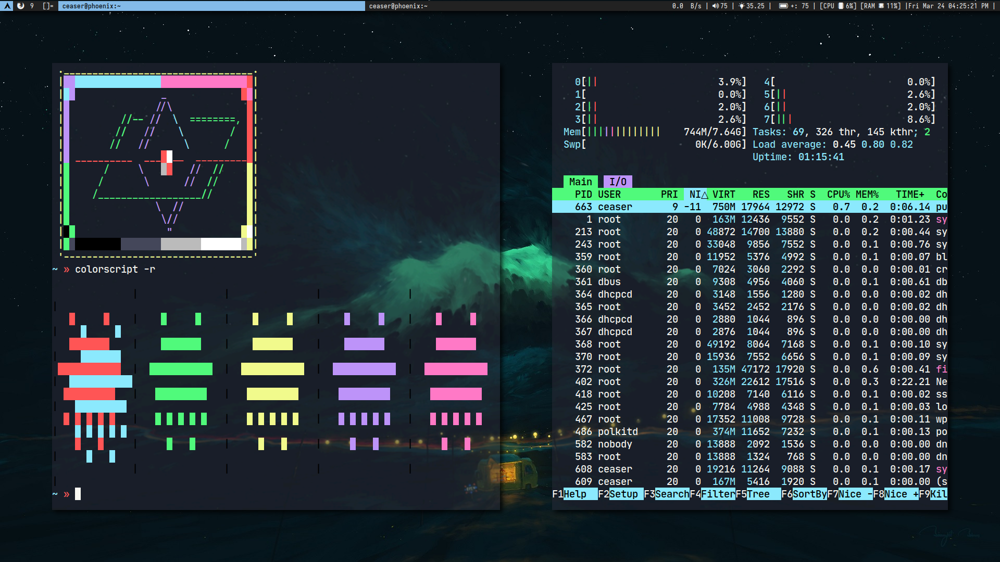
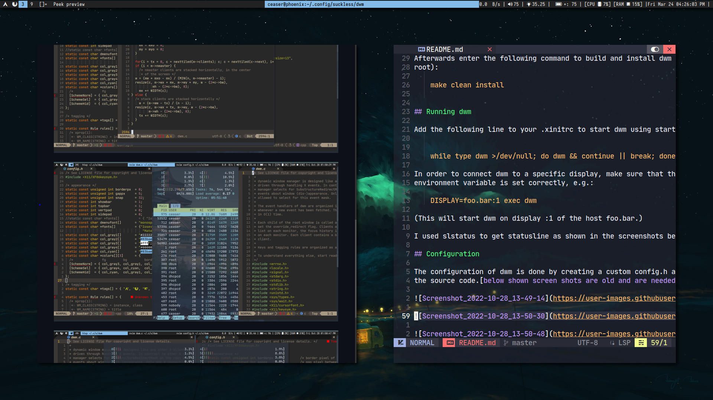

# WARNING!!!
This dwm is configured according to my liking most of the keybindings maynot work for you.
Firstly, check config.def.h to ensure you have everything written inside `SCHMD` function. 
I also have custom scripts for dunst(for notification).

# dwm - dynamic window manager

dwm is an extremely fast, small, and dynamic window manager for X. These are the
patches that I have apllied to this dwm:

   - spiral 
   - dwindle 
   - horizgrid 
   - centeredmaster 
   - centeredfloatingmaster
   - hide_vacant_tags - only shows non-vacant tags on bar
   - hide_and_restore_hidden_stacks - hide and restore windows
   - fullgapps - enables you to resize gapps between windows

## Requirements

In order to build dwm you need the Xlib header files.

## Installation

Edit config.mk to match your local setup (dwm is installed into the /usr/local
namespace by default).

Afterwards enter the following command to build and install dwm (if necessary as
root):

    make clean install
    

## Running dwm

Add the following line to your .xinitrc to start dwm using startx [without killing all applications]:

    while type dwm >/dev/null; do dwm && continue || break; done

In order to connect dwm to a specific display, make sure that the DISPLAY
environment variable is set correctly, e.g.:

    DISPLAY=foo.bar:1 exec dwm

(This will start dwm on display :1 of the host foo.bar.)

I used slstatus to get statusline as shown in the screenshots below:

## Configuration

The configuration of dwm is done by creating a custom config.h and (re)compiling
the source code.[below shown screen shots are old and are needed to be updated]
gscreenshot_2023-03-24-162524.png
<!--  -->

<!--  -->

<!--  -->

